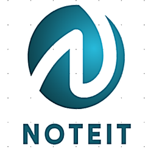
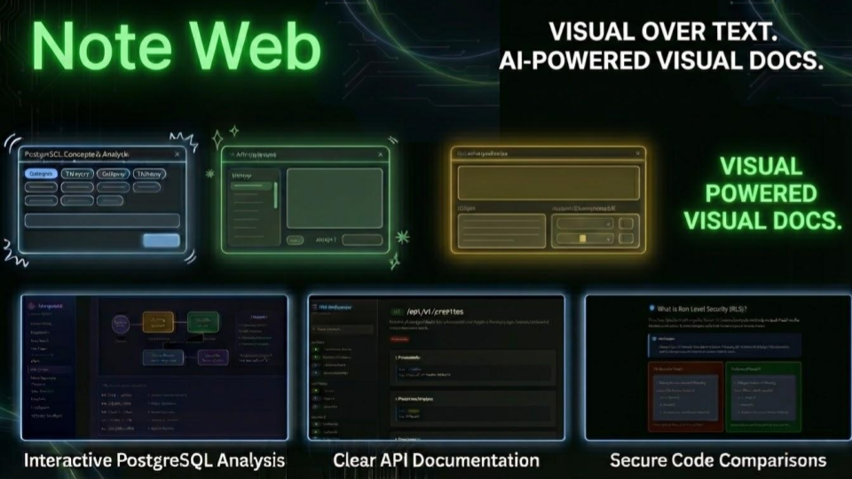
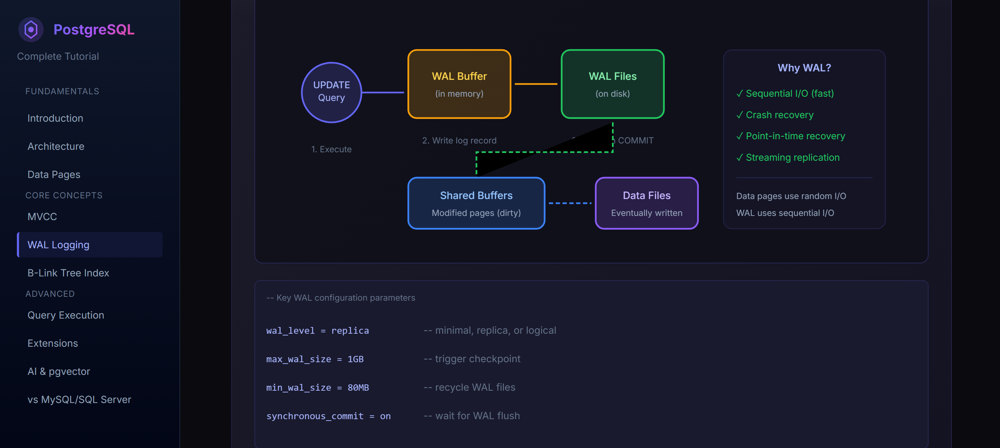
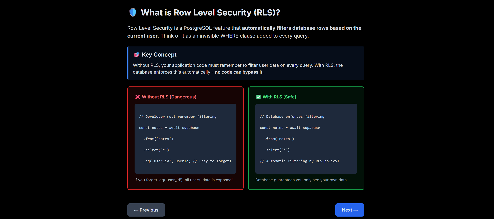
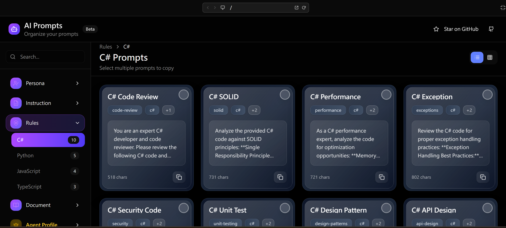

<p align="center">
  
</p>

# Noteit MCP

[](https://choosealicense.com/licenses/mit/)
[](https://modelcontextprotocol.io/)
[](https://oauth.net/2.1/)

> **🩹 The cure for AI "Markdown Hell" - AI prompt library + visual knowledge hub for developers**

Noteit-MCP transforms drowning in 5,000-word documents into navigable HTML and logic diagrams instantly. With 60+ expert personas, organize complex ideas without cognitive overload. Makes Specification-Driven Development actually human-readable.

## ✨ Demo & Screenshots

<p align="center">
  
  <br />
  <em>📊 Unified dashboard with agent profiles and note management</em>
</p>

<p align="center">
  
  <br />
  <em>🤖 40+ pre-built agent templates for different coding tasks</em>
</p>

<p align="center">
  
  <br />
  <em>📝 AI-readable notes with graph visualizations</em>
</p>

## 1) What is Noteit MCP?

Noteit MCP is an HTTP MCP server (Next.js API route) that lets AI coding tools securely access two core systems:

- **Agent Profiles**: Composable configurations (personas, instructions, rules, documents) that shape AI behavior for specific tasks.
- **Notes**: Personal note-taking with structured records and graph visualizations.

Authentication uses **OAuth 2.1 with device fingerprint** for IDEs that support it, with an optional **API Token** flow for other MCP clients. The server endpoint is exposed at `/api/mcp`.

## 2) Why use Noteit MCP?

- **Unified configuration**: Reusable agent profiles that any AI client can adopt.
- **Productive note-taking**: AI-readable notes, tasks, and visual graphs.
- **Secure by design**: OAuth 2.1 + transparent token refresh; API token for non‑OAuth clients.
- **Works across IDEs**: Cursor, Claude Code, Gemini CLI, Claude Desktop (via proxy), and more.

<p align="center">
  
  <br />
  <em>60+ expert personas for different coding tasks and workflows</em>
</p>

## 3) How to connect

The MCP server is at `https://www.noteit-mcp.com/api/mcp`.

### Cursor (mcp.json)

Create or update `~/.cursor/mcp.json`:

```json
{
  "mcpServers": {
    "noteit-mcp": {
      "url": "https://www.noteit-mcp.com/api/mcp"
    }
  }
}
```

Then restart Cursor. OAuth will be handled automatically.

### Claude Code (built-in MCP)

Use the command-line helper (global scope):

```bash
claude mcp add --transport http noteit-mcp https://www.noteit-mcp.com/api/mcp
```

Or project scope:

```bash
claude mcp add -s project --transport http noteit-mcp https://www.noteit-mcp.com/api/mcp
```

### Gemini CLI

Add the server and authenticate:

```bash
gemini mcp add --transport http noteit-mcp https://www.noteit-mcp.com/api/mcp
/mcp auth noteit-mcp
/mcp  # verify tools are listed
```

### Other IDEs (API Token)

Login at [https://www.noteit-mcp.com](https://www.noteit-mcp.com/) to obtain an API token.

---

## ⭐ Star this project

If Noteit MCP helps streamline your AI workflow, please give it a star! It helps others discover this tool and motivates continued development.

## License

MIT


